# 宠里个宠数据库文档

> 当前结构版本：Flyway `V12`
> 当前业务表数量：34
> 默认数据库：MySQL 8.0 / `pet_assistant`
> 最后同步：2026-08-31
> 结构真相：`backend/business-service/src/main/resources/db/migration`

## 1. 文档用途与维护规则

本文档描述当前**已经实现并运行**的数据结构，不记录尚未落地的规划表。后续开发必须遵守以下规则：

1. 已执行的 Flyway 历史迁移 `V1～V12` 不得修改、删除或重新编号。
2. 表、字段、索引、外键、检查约束或数据库注释发生变化时，新增下一个 Flyway 迁移，例如下一版使用 `V13__describe_change.sql`。
3. 每次新增迁移时，同一次代码修改必须同步更新本文档的版本、ER 图、字段字典、索引、关系、状态枚举和迁移历史。
4. Java 实体、MyBatis Mapper/XML、测试、周开发文档和本文档必须使用同一套字段名称与状态值。
5. 本文档禁止保存数据库密码、用户真实资料、API Key、JWT、刷新令牌原文或生产数据样例。
6. `flyway_schema_history` 是 Flyway 自动维护的系统表，不计入 34 张业务表。

## 2. 数据库约定

| 项目 | 当前约定 |
|---|---|
| 数据库 | MySQL 8.0 Community |
| 默认库名 | `pet_assistant`，可通过 `MYSQL_DATABASE` 修改 |
| 存储引擎 | InnoDB |
| 字符集 | `utf8mb4` |
| 排序规则 | `utf8mb4_0900_ai_ci` |
| 主键 | 普通实体使用 Java 生成的 `CHAR(36)` UUID；关系表使用联合主键 |
| 时间精度 | `TIMESTAMP(6)`，JDBC 连接时区为 `Asia/Shanghai` |
| 表结构管理 | Flyway；禁止通过 MyBatis 自动建表 |
| 数据访问 | MyBatis Mapper 接口 + XML |
| 软删除 | 帖子、评论通过状态字段保留审计事实 |
| 命名 | MySQL 使用 `snake_case`，Java 使用 `camelCase` |
| 中文注释 | V12 为 34 张业务表和 324 个字段写入 `TABLE_COMMENT/COLUMN_COMMENT`；数据库客户端刷新元数据后可直接查看 |

### 2.1 中文注释维护规则

- V12 只补充表和字段注释，没有修改业务数据、索引、外键或字段语义。
- 后续新增表或字段时，必须在对应 `CREATE TABLE` 或 `ADD COLUMN` 定义中直接写入中文 `COMMENT`，避免数据字典再次缺失。
- 修改字段类型时必须同时保留或更新原 `COMMENT`；MySQL 的 `MODIFY COLUMN` 会以新定义覆盖旧字段注释。
- DataGrip、Navicat 或 IDEA Database 面板需要执行“刷新/同步”后，才会重新读取 `INFORMATION_SCHEMA` 中的注释。

## 3. 业务表总览

| 领域 | 表 | 作用 | 首次迁移 |
|---|---|---|---|
| 用户 | `app_user` | 登录凭据、角色、状态和公开资料 | V1，V5/V6 扩展 |
| 问答 | `conversation` | 用户会话摘要 | V1 |
| 问答 | `message` | 会话完整消息事实 | V1 |
| 问答 | `answer_feedback` | 对单条回答的赞成/反对反馈 | V1 |
| 消息 | `user_notification` | 评论、点赞、关注、审核和系统通知事实 | V8 |
| 消息 | `direct_conversation` | 两位用户之间唯一的私信会话 | V8 |
| 消息 | `direct_message` | 私信正文、客户端幂等号和已读状态 | V8 |
| 知识库 | `knowledge_submission` | 管理员资料/社区经验投稿、授权、预检与当前状态 | V9 |
| 知识库 | `knowledge_submission_version` | 每次投稿的不可变原文/清洗结果快照 | V9 |
| 知识库 | `knowledge_review_record` | 追加式审核、发布、撤回和失败时间线 | V9 |
| 知识库 | `knowledge_document` | 审核通过后的可检索发布版本 | V1，V4/V9 扩展 |
| 知识库 | `knowledge_chunk` | 文档分块、页码和向量 | V1，V2/V4 扩展 |
| 宠物 | `pet_profile` | 用户拥有的宠物档案 | V3，V5 扩展 |
| 管理 | `admin_audit_log` | 管理员角色/状态变更审计 | V6 |
| 社区 | `community_topic` | 社区话题字典 | V6 |
| 社区 | `community_post` | 帖子正文、状态、统计和位置 | V6，V7 扩展 |
| 社区 | `community_media` | MinIO 对象的业务元数据 | V6 |
| 集成 | `integration_outbox` | RabbitMQ 可靠发布的事务事件 | V6 |
| 搜索 | `search_history` | 当前用户的私人查询历史、筛选快照和次数 | V10 |
| 搜索 | `search_index_job` | OpenSearch 全量重建任务事实与进度 | V10 |
| 社区 | `community_comment` | 两级评论与软删除状态 | V7 |
| 社区 | `community_post_like` | 用户与帖子的点赞事实 | V7 |
| 社区 | `community_post_favorite` | 用户与帖子的收藏事实 | V7 |
| 社区 | `community_user_follow` | 用户关注关系 | V7 |
| 治理 | `community_report` | 帖子、评论或用户举报 | V7 |
| 社区 | `community_checkin` | 每日签到事实 | V7 |
| 社区 | `community_post_repost` | 幂等转发/引用转发关系 | V11 |
| 治理 | `community_user_relation_control` | MUTE/BLOCK 及撤销事实 | V11 |
| 推荐 | `community_recommendation_feedback` | 不感兴趣反馈事实 | V11 |
| 推荐 | `community_trend_snapshot` | 定时生成的可解释趋势快照 | V11 |
| 运维 | `scheduled_job_execution` | Quartz 批次、尝试和结果审计 | V11 |
| 集成 | `processed_integration_event` | RabbitMQ 消费者幂等认领 | V11 |
| 集成 | `integration_event_manual_review` | 超限 Outbox 人工处理清单 | V11 |
| 管理 | `admin_audit_log_archive` | 旧管理员审计归档 | V11 |

## 4. 实体关系图

```mermaid
erDiagram
    app_user ||--o{ conversation : owns
    conversation ||--o{ message : contains
    message ||--o| answer_feedback : receives

    app_user ||--o{ user_notification : receives
    app_user o|--o{ user_notification : acts
    app_user ||--o{ direct_conversation : participant_low
    app_user ||--o{ direct_conversation : participant_high
    direct_conversation ||--o{ direct_message : contains
    app_user ||--o{ direct_message : sends
    app_user ||--o{ direct_message : receives

    app_user o|--o{ knowledge_submission : authors
    knowledge_submission ||--o{ knowledge_submission_version : snapshots
    knowledge_submission ||--o{ knowledge_review_record : audits
    knowledge_submission o|--o{ knowledge_document : publishes
    knowledge_document ||--o{ knowledge_chunk : splits_into

    app_user ||--o{ pet_profile : owns
    app_user ||--o{ admin_audit_log : acts
    app_user o|--o{ admin_audit_log : targets

    app_user ||--o{ community_post : authors
    pet_profile o|--o{ community_post : relates_to
    community_topic o|--o{ community_post : classifies
    app_user ||--o{ community_media : owns
    community_post o|--o{ community_media : attaches

    community_post ||--o{ community_comment : contains
    app_user ||--o{ community_comment : writes
    community_comment o|--o{ community_comment : replies_to

    app_user ||--o{ community_post_like : creates
    community_post ||--o{ community_post_like : receives
    app_user ||--o{ community_post_favorite : creates
    community_post ||--o{ community_post_favorite : receives

    app_user ||--o{ community_user_follow : follower
    app_user ||--o{ community_user_follow : followed
    app_user ||--o{ community_report : reports
    app_user o|--o{ community_report : moderates
    app_user ||--o{ community_checkin : checks_in
    app_user ||--o{ search_history : searches
    app_user o|--o{ search_index_job : requests
    app_user ||--o{ community_post_repost : reposts
    community_post ||--o{ community_post_repost : receives
    app_user ||--o{ community_user_relation_control : controls
    community_post ||--o{ community_recommendation_feedback : receives_feedback
    integration_outbox ||--o| integration_event_manual_review : escalates
```



`community_report.target_id` 和 `integration_outbox.aggregate_id` 是多态业务 ID，因此数据库没有为它们建立单一外键；目标存在性由 Service 层按类型校验。

## 5. 用户、认证与宠物档案

### 5.1 `app_user`

用途：系统账号、认证、角色权限和用户公开资料。对应 `UserEntity`、`UserMapper`、`UserMapper.xml`。

| 字段 | 类型 | 可空 | 默认值 | 约束/含义 |
|---|---|---:|---|---|
| `id` | CHAR(36) | 否 | 无 | 主键 UUID |
| `username` | VARCHAR(64) | 否 | 无 | 登录名，唯一 |
| `password_hash` | VARCHAR(100) | 否 | 无 | BCrypt 散列，绝不返回前端 |
| `display_name` | VARCHAR(100) | 是 | NULL | 公开昵称 |
| `role` | VARCHAR(30) | 否 | `USER` | `USER/VERIFIED_SELLER/MODERATOR/ADMIN` |
| `status` | VARCHAR(20) | 否 | `ACTIVE` | `ACTIVE/DISABLED/LOCKED` |
| `security_version` | BIGINT | 否 | 1 | 角色或状态变化时递增，使旧 JWT 失效 |
| `avatar_url` | VARCHAR(1000) | 是 | NULL | 头像访问地址 |
| `bio` | VARCHAR(500) | 是 | NULL | 个人简介 |
| `region` | VARCHAR(100) | 是 | NULL | 用户填写的地区文本 |
| `last_login_at` | TIMESTAMP(6) | 是 | NULL | 最近成功登录时间 |
| `created_at` | TIMESTAMP(6) | 否 | CURRENT_TIMESTAMP(6) | 创建时间 |
| `updated_at` | TIMESTAMP(6) | 否 | 自动时间 | 更新时自动刷新 |

索引与约束：主键 `PRIMARY(id)`；唯一索引 `uk_app_user_username(username)`；角色和状态由 `CHECK` 限定。

### 5.2 `pet_profile`

用途：宠物姓名、类型和健康问答所需的基础资料。对应 `PetProfileEntity`、`PetProfileMapper`、`PetProfileMapper.xml`。

| 字段 | 类型 | 可空 | 默认值 | 约束/含义 |
|---|---|---:|---|---|
| `id` | CHAR(36) | 否 | 无 | 主键 UUID |
| `user_id` | CHAR(36) | 是 | NULL | 档案所有者；仅为兼容 V5 前历史匿名数据而允许空 |
| `name` | VARCHAR(80) | 否 | 无 | 宠物名称 |
| `pet_type` | VARCHAR(30) | 否 | 无 | 当前应用使用 `CAT/DOG/OTHER` |
| `breed` | VARCHAR(100) | 是 | NULL | 品种 |
| `age_months` | INT | 是 | NULL | 0～600 月 |
| `weight_kg` | DECIMAL(6,2) | 是 | NULL | 必须大于 0 |
| `notes` | VARCHAR(1000) | 是 | NULL | 备注 |
| `created_at` | TIMESTAMP(6) | 否 | CURRENT_TIMESTAMP(6) | 创建时间 |
| `updated_at` | TIMESTAMP(6) | 否 | 自动时间 | 更新时间 |

索引与关系：`idx_pet_profile_created(created_at DESC)`；`idx_pet_profile_user_created(user_id, created_at DESC)`；`user_id → app_user.id ON DELETE CASCADE`。新建档案时 Service 必须写入当前 JWT 用户 ID。

### 5.3 `admin_audit_log`

用途：保存管理员对用户角色和状态等治理操作。对应 `AdminAuditEntity`、`AdminAuditMapper`、`AdminAuditMapper.xml`。

| 字段 | 类型 | 可空 | 默认值 | 含义 |
|---|---|---:|---|---|
| `id` | CHAR(36) | 否 | 无 | 审计记录主键 |
| `actor_user_id` | CHAR(36) | 否 | 无 | 操作管理员 |
| `target_user_id` | CHAR(36) | 是 | NULL | 被操作用户 |
| `action` | VARCHAR(60) | 否 | 无 | 操作类型 |
| `before_value` | VARCHAR(500) | 是 | NULL | 变更前摘要 |
| `after_value` | VARCHAR(500) | 是 | NULL | 变更后摘要 |
| `created_at` | TIMESTAMP(6) | 否 | CURRENT_TIMESTAMP(6) | 操作时间 |

索引与关系：`idx_admin_audit_created(created_at DESC)`；`idx_admin_audit_target(target_user_id, created_at DESC)`；操作人删除受限制，目标用户删除时 `target_user_id` 置空。

## 6. 会话与消息

### 6.1 `conversation`

用途：会话标题、状态和更新时间摘要。完整消息不存本表。对应 `ConversationEntity`、`ConversationMapper`。

| 字段 | 类型 | 可空 | 默认值 | 含义 |
|---|---|---:|---|---|
| `id` | CHAR(36) | 否 | 无 | 会话 UUID |
| `user_id` | CHAR(36) | 是 | NULL | 所属用户 |
| `title` | VARCHAR(200) | 否 | 无 | 首问前 30 个 Unicode 字符生成的标题 |
| `status` | VARCHAR(20) | 否 | `ACTIVE` | 会话状态，当前使用 `ACTIVE` |
| `created_at` | TIMESTAMP(6) | 否 | CURRENT_TIMESTAMP(6) | 创建时间 |
| `updated_at` | TIMESTAMP(6) | 否 | 自动时间 | 新增消息时更新，用于历史排序 |

索引与关系：`idx_conversation_user_updated(user_id, updated_at DESC)`；用户删除时 `user_id` 置空，历史会话仍保留。

### 6.2 `message`

用途：会话的完整消息事实，是 Redis 最近上下文缓存的 MySQL 回源。对应 `MessageEntity`，由 `ConversationMapper` 管理。

| 字段 | 类型 | 可空 | 默认值 | 约束/含义 |
|---|---|---:|---|---|
| `id` | CHAR(36) | 否 | 无 | 消息 UUID |
| `conversation_id` | CHAR(36) | 否 | 无 | 所属会话 |
| `role` | VARCHAR(20) | 否 | 无 | `USER/ASSISTANT/SYSTEM/TOOL` |
| `content` | TEXT | 否 | 无 | 消息正文 |
| `model_name` | VARCHAR(100) | 是 | NULL | 助手消息所用模型 |
| `token_count` | INT | 是 | NULL | Token 统计或估算 |
| `created_at` | TIMESTAMP(6) | 否 | CURRENT_TIMESTAMP(6) | 创建时间 |

索引与关系：`idx_message_conversation_created(conversation_id, created_at)`；删除会话时消息级联删除。

### 6.3 `answer_feedback`

用途：一条回答最多保存一份正向或负向反馈。当前已建表，但尚未接入独立 MyBatis Mapper 和网页入口。

| 字段 | 类型 | 可空 | 默认值 | 约束/含义 |
|---|---|---:|---|---|
| `id` | CHAR(36) | 否 | 无 | 主键 UUID |
| `message_id` | CHAR(36) | 否 | 无 | 被评价的消息，唯一 |
| `rating` | TINYINT | 否 | 无 | 只能为 `-1` 或 `1` |
| `comment` | VARCHAR(1000) | 是 | NULL | 可选说明 |
| `created_at` | TIMESTAMP(6) | 否 | CURRENT_TIMESTAMP(6) | 反馈时间 |

索引与关系：唯一索引 `uk_answer_feedback_message(message_id)`；消息删除时反馈级联删除。

### 6.4 `user_notification`

用途：保存站内通知最终事实。评论、点赞、关注、审核和系统事件先写本表，Redis 仅缓存未读数并进行在线推送。对应 `NotificationEntity`、`MessageMapper`、`MessageMapper.xml`。

| 字段 | 类型 | 可空 | 默认值 | 约束/含义 |
|---|---|---:|---|---|
| `id` | CHAR(36) | 否 | 无 | 通知 UUID |
| `recipient_id` | CHAR(36) | 否 | 无 | 接收用户 |
| `actor_id` | CHAR(36) | 是 | NULL | 触发用户；系统通知或用户删除后为空 |
| `notification_type` | VARCHAR(30) | 否 | 无 | `COMMENT/LIKE/FOLLOW/MODERATION/SYSTEM` |
| `target_type` | VARCHAR(30) | 是 | NULL | `POST/COMMENT/USER` 等业务目标类型 |
| `target_id` | CHAR(36) | 是 | NULL | 业务目标 ID；由 Service 按类型校验 |
| `title` | VARCHAR(160) | 否 | 无 | 消息中心短标题 |
| `content` | VARCHAR(1000) | 否 | 无 | 通知正文摘要 |
| `dedupe_key` | VARCHAR(180) | 否 | 无 | 同一接收人的稳定幂等键 |
| `read_at` | TIMESTAMP(6) | 是 | NULL | 空表示未读 |
| `created_at` | TIMESTAMP(6) | 否 | CURRENT_TIMESTAMP(6) | 创建时间 |

索引与约束：`UNIQUE(recipient_id, dedupe_key)` 防止重复事件重复通知；`idx_notification_recipient_unread(recipient_id, read_at, created_at DESC)` 支持未读回源；接收人删除时级联删除，触发用户删除时 `actor_id` 置空。`target_id` 为多态业务 ID，不建单一外键。

### 6.5 `direct_conversation`

用途：保存两位用户之间唯一的私信会话摘要。参与者 ID 按字符串大小固定写入 low/high，避免 A→B 与 B→A 创建两条会话。对应 `DirectConversationEntity` 和 `MessageMapper`。

| 字段 | 类型 | 可空 | 默认值 | 约束/含义 |
|---|---|---:|---|---|
| `id` | CHAR(36) | 否 | 无 | 私信会话 UUID |
| `participant_low_id` | CHAR(36) | 否 | 无 | 字典序较小的参与者 ID |
| `participant_high_id` | CHAR(36) | 否 | 无 | 字典序较大的参与者 ID |
| `last_message_at` | TIMESTAMP(6) | 是 | NULL | 最近一条私信时间 |
| `created_at` | TIMESTAMP(6) | 否 | CURRENT_TIMESTAMP(6) | 创建时间 |
| `updated_at` | TIMESTAMP(6) | 否 | 自动时间 | 最近消息写入时更新 |

索引与约束：`UNIQUE(participant_low_id, participant_high_id)` 保证用户对唯一；`CHECK(participant_low_id < participant_high_id)` 固定顺序；两个参与者均级联到 `app_user`。任何一方删除账号时，私信会话及消息随之删除。

### 6.6 `direct_message`

用途：保存私信正文、发送方客户端幂等号和接收方已读时间。正文只存 MySQL，不写入 Redis Stream。对应 `DirectMessageEntity`、`MessageMapper`、`MessageMapper.xml`。

| 字段 | 类型 | 可空 | 默认值 | 约束/含义 |
|---|---|---:|---|---|
| `id` | CHAR(36) | 否 | 无 | 私信 UUID |
| `conversation_id` | CHAR(36) | 否 | 无 | 所属私信会话 |
| `sender_id` | CHAR(36) | 否 | 无 | 发送用户 |
| `recipient_id` | CHAR(36) | 否 | 无 | 接收用户 |
| `client_message_id` | CHAR(36) | 否 | 无 | 前端生成并在重试时复用的 UUID |
| `content` | VARCHAR(2000) | 否 | 无 | 私信正文，去除首尾空白后写入 |
| `read_at` | TIMESTAMP(6) | 是 | NULL | 接收人首次打开会话时写入 |
| `created_at` | TIMESTAMP(6) | 否 | CURRENT_TIMESTAMP(6) | 创建时间 |

索引与约束：`UNIQUE(sender_id, client_message_id)` 让网络重试返回同一消息；`idx_direct_message_conversation(conversation_id, created_at ASC)` 用于消息时间线；`idx_direct_message_recipient_unread(recipient_id, read_at, created_at DESC)` 用于未读回源；禁止给自己发私信；会话或任一参与用户删除时级联删除。

## 7. 知识库与向量

### 7.1 `knowledge_document`

用途：保存人工审核通过并已经发布的可检索版本。对应 `KnowledgePublicationEntity`、`KnowledgeMapper`；不再存在“直接导入即生效”接口。

| 字段 | 类型 | 可空 | 默认值 | 含义 |
|---|---|---:|---|---|
| `id` | CHAR(36) | 否 | 无 | 文档 UUID |
| `submission_id` | CHAR(36) | 是 | NULL | 来源投稿；V9 前历史文档为空 |
| `title` | VARCHAR(300) | 否 | 无 | 标题 |
| `source_type` | VARCHAR(30) | 否 | `ADMIN_UPLOAD` | `ADMIN_UPLOAD/COMMUNITY_POST` |
| `source_business_id` | CHAR(36) | 是 | NULL | 社区帖子等原业务 ID |
| `source_url` | VARCHAR(1000) | 是 | NULL | 来源链接 |
| `source_name` | VARCHAR(200) | 是 | NULL | 来源名称 |
| `source_author` | VARCHAR(120) | 是 | NULL | 原资料作者 |
| `author_user_id` | CHAR(36) | 是 | NULL | 平台投稿用户 |
| `file_name` | VARCHAR(255) | 是 | NULL | PDF/TXT/Markdown 文件名，仅管理端追踪 |
| `document_type` | VARCHAR(20) | 否 | `TEXT` | 当前使用 `TEXT/PDF` |
| `pet_type` | VARCHAR(30) | 否 | 无 | 宠物类型过滤条件 |
| `category` | VARCHAR(50) | 否 | 无 | 知识分类 |
| `language_code` | VARCHAR(10) | 否 | `zh-CN` | 语言 |
| `content` | LONGTEXT | 否 | 无 | 清洗后的完整正文 |
| `content_checksum` | CHAR(64) | 否 | 无 | 正文 SHA-256，唯一去重 |
| `status` | VARCHAR(20) | 否 | `READY` | `READY/SUPERSEDED/WITHDRAWN`；只有 READY 可召回 |
| `review_status` | VARCHAR(20) | 否 | `APPROVED` | 检索时必须为 APPROVED |
| `trust_level` | CHAR(1) | 否 | `A` | `A/B/C` 来源信任等级 |
| `quality_score` | DECIMAL(5,2) | 是 | NULL | 0～100 预检质量辅助分 |
| `consent_status` | VARCHAR(20) | 否 | `NOT_REQUIRED` | `GRANTED/NOT_REQUIRED/WITHDRAWN` |
| `reviewer_user_id` | CHAR(36) | 是 | NULL | 最终批准管理员 |
| `reviewed_at` | TIMESTAMP(6) | 是 | NULL | 人工审核时间 |
| `version` | INT | 否 | 1 | 投稿版本 |
| `published_at` | TIMESTAMP(6) | 是 | NULL | 进入 RAG 时间 |
| `expires_at` | TIMESTAMP(6) | 是 | NULL | 到期后自动退出召回 |
| `created_at` | TIMESTAMP(6) | 否 | CURRENT_TIMESTAMP(6) | 导入时间 |
| `updated_at` | TIMESTAMP(6) | 否 | 自动时间 | 更新时间 |

索引：`uk_knowledge_document_checksum(content_checksum)`；`idx_knowledge_document_filter(pet_type, category, status)`；`idx_knowledge_document_submission(submission_id, version)`；`idx_knowledge_document_retrievable(status, review_status, consent_status, expires_at)`。检索 SQL 同时要求 `READY + APPROVED + 非 WITHDRAWN + 未过期`。

### 7.2 `knowledge_submission`

用途：投稿状态机主表，保存来源、授权、原文、预检结果、当前版本和已发布文档关联。对应 `KnowledgeSubmissionEntity`、`KnowledgeSubmissionMapper`。

| 字段组 | 字段 | 含义 |
|---|---|---|
| 标识 | `id/source_type/source_business_id/author_user_id` | 投稿 UUID、`COMMUNITY_POST/ADMIN_UPLOAD`、原帖子 ID、平台作者 |
| 来源 | `title/source_name/source_author/source_url/file_name/document_type` | 标题、机构、原作者、链接、文件名和 `TEXT/PDF` |
| 分类 | `pet_type/category` | `CAT/DOG/OTHER` 与知识分类 |
| 正文 | `original_content/cleaned_content/content_checksum` | 版本原文、预检清洗文和 SHA-256 |
| 授权 | `consent_status` | `GRANTED/NOT_REQUIRED/WITHDRAWN` |
| 状态机 | `status` | `PRECHECKING → PENDING_REVIEW → PUBLISHING → PUBLISHED`，或 `REJECTED/WITHDRAWN/FAILED` |
| 预检 | `risk_level/risk_labels/ai_summary/quality_score` | LOW/MEDIUM/HIGH、规则标签、摘要和 0～100 分 |
| 审核 | `current_version/reviewer_user_id/reviewed_at/error_message` | 乐观版本、审核人、审核时间、失败/驳回说明 |
| 发布 | `published_document_id/source_published_at/published_at/expires_at` | RAG 文档、原资料日期、实际发布时间、有效期 |
| 审计时间 | `created_at/updated_at` | 首次投稿和最近状态变化 |

约束：`UNIQUE(source_type, source_business_id)` 让同一社区帖子复用一条投稿并递增版本；管理员上传的业务 ID 为 NULL，可创建多条。作者/审核人删除时置空；`published_document_id` 删除时置空。

### 7.3 `knowledge_submission_version`

用途：每次提交保存不可变审核快照，防止管理员看到 v1 后作者把正文改成 v2。字段为 `id/submission_id/version/title/original_content/cleaned_content/content_checksum/ai_summary/risk_level/risk_labels/quality_score/created_at`。唯一索引 `UNIQUE(submission_id, version)`；投稿删除时版本级联删除。

### 7.4 `knowledge_review_record`

用途：追加式时间线，不通过覆盖主表丢失历史。字段为 `id/submission_id/version/reviewer_user_id/action/trust_level/reason/created_at`。`action` 只允许 `SUBMITTED/PRECHECK_COMPLETED/APPROVED/REJECTED/PUBLISHED/WITHDRAWN/FAILED`；`trust_level` 只允许 `A/B/C`；投稿删除时级联删除，审核人删除时置空。

### 7.5 `knowledge_chunk`

用途：保存可检索分块、来源页码和本地向量。对应 `KnowledgeChunkEntity`、`KnowledgeMapper`。

| 字段 | 类型 | 可空 | 默认值 | 含义 |
|---|---|---:|---|---|
| `id` | CHAR(36) | 否 | 无 | 分块 UUID |
| `document_id` | CHAR(36) | 否 | 无 | 所属文档 |
| `chunk_index` | INT | 否 | 无 | 文档内从 0 开始的顺序 |
| `content` | TEXT | 否 | 无 | 分块正文 |
| `char_count` | INT | 否 | 无 | 字符数 |
| `token_estimate` | INT | 否 | 无 | Token 估算 |
| `embedding_json` | JSON | 是 | NULL | 当前 MySQL 兼容方案保存的向量数组 |
| `embedding_model` | VARCHAR(100) | 是 | NULL | 向量模型名称 |
| `embedding_dimensions` | SMALLINT | 是 | NULL | 向量维度 |
| `page_start` | INT | 是 | NULL | PDF 起始页 |
| `page_end` | INT | 是 | NULL | PDF 结束页 |
| `embedded_at` | TIMESTAMP(6) | 是 | NULL | 最近向量化时间 |
| `created_at` | TIMESTAMP(6) | 否 | CURRENT_TIMESTAMP(6) | 创建时间 |

索引与关系：`uk_knowledge_chunk_order(document_id, chunk_index)`；`idx_knowledge_chunk_document(document_id)`；`idx_knowledge_chunk_embedding_model(embedding_model, document_id)`；`idx_knowledge_chunk_document_page(document_id, page_start, page_end)`；删除文档时分块级联删除。

## 8. 社区内容与媒体

### 8.1 `community_topic`

用途：社区帖子分类字典。通过 `CommunityPostMapper` 读取。

| 字段 | 类型 | 可空 | 默认值 | 约束/含义 |
|---|---|---:|---|---|
| `id` | CHAR(36) | 否 | 无 | 话题 ID |
| `name` | VARCHAR(80) | 否 | 无 | 唯一名称 |
| `description` | VARCHAR(300) | 是 | NULL | 说明 |
| `status` | VARCHAR(20) | 否 | `ACTIVE` | `ACTIVE/DISABLED` |
| `created_at` | TIMESTAMP(6) | 否 | CURRENT_TIMESTAMP(6) | 创建时间 |

V6 初始化了“科学喂养、健康护理、萌宠日常”三条种子话题。唯一索引为 `uk_community_topic_name(name)`。

### 8.2 `community_post`

用途：社区帖子主表。对应 `CommunityPostEntity`、`CommunityPostMapper`。

| 字段 | 类型 | 可空 | 默认值 | 约束/含义 |
|---|---|---:|---|---|
| `id` | CHAR(36) | 否 | 无 | 帖子 UUID |
| `author_id` | CHAR(36) | 否 | 无 | 作者 |
| `pet_profile_id` | CHAR(36) | 是 | NULL | 可选关联宠物 |
| `topic_id` | CHAR(36) | 是 | NULL | 可选话题 |
| `title` | VARCHAR(160) | 否 | 无 | 标题 |
| `content` | TEXT | 否 | 无 | 正文 |
| `region` | VARCHAR(100) | 是 | NULL | 地区文本 |
| `latitude` | DECIMAL(10,7) | 是 | NULL | 纬度，Service 校验 -90～90 |
| `longitude` | DECIMAL(10,7) | 是 | NULL | 经度，Service 校验 -180～180 |
| `status` | VARCHAR(30) | 否 | `DRAFT` | `DRAFT/PENDING_REVIEW/PUBLISHED/HIDDEN/DELETED` |
| `view_count` | BIGINT | 否 | 0 | MySQL 浏览基数；Redis 增量定时回写 |
| `like_count` | BIGINT | 否 | 0 | 点赞关系汇总快照 |
| `comment_count` | BIGINT | 否 | 0 | 公开评论汇总快照 |
| `favorite_count` | BIGINT | 否 | 0 | 收藏关系汇总快照 |
| `version` | INT | 否 | 1 | 编辑和治理乐观锁版本 |
| `published_at` | TIMESTAMP(6) | 是 | NULL | 发布时间 |
| `created_at` | TIMESTAMP(6) | 否 | CURRENT_TIMESTAMP(6) | 创建时间 |
| `updated_at` | TIMESTAMP(6) | 否 | 自动时间 | 更新时间 |

索引：

- `idx_community_post_author_updated(author_id, updated_at DESC)`：个人主页和草稿。
- `idx_community_post_public(status, published_at DESC)`：最新公开流。
- `idx_community_post_topic_public(topic_id, status, published_at DESC)`：话题流。
- `idx_community_post_region_public(region, status, published_at DESC)`：GEO 不可用时地区回源。

关系：作者删除默认受限制；宠物或话题删除时对应字段置空。帖子删除采用 `status=DELETED`，不直接删除主记录。

### 8.3 `community_media`

用途：保存 MinIO 对象的所有权、状态和帖子绑定关系；二进制内容不进入 MySQL。对应 `CommunityMediaEntity`、`CommunityMediaMapper`。

| 字段 | 类型 | 可空 | 默认值 | 约束/含义 |
|---|---|---:|---|---|
| `id` | CHAR(36) | 否 | 无 | 媒体 UUID |
| `owner_id` | CHAR(36) | 否 | 无 | 上传用户 |
| `post_id` | CHAR(36) | 是 | NULL | 绑定帖子 |
| `object_key` | VARCHAR(600) | 否 | 无 | MinIO 桶内对象 Key，唯一 |
| `original_filename` | VARCHAR(255) | 否 | 无 | 原文件名，只用于管理追踪，前端帖子不展示 |
| `media_type` | VARCHAR(20) | 否 | 无 | `IMAGE/VIDEO` |
| `content_type` | VARCHAR(100) | 否 | 无 | MIME 类型 |
| `size_bytes` | BIGINT | 否 | 无 | 确认上传时从 MinIO 读取的大小 |
| `checksum_sha256` | CHAR(64) | 是 | NULL | 可选校验和 |
| `status` | VARCHAR(20) | 否 | `PENDING` | `PENDING/CONFIRMED/REJECTED` |
| `processing_status` | VARCHAR(20) | 否 | `WAITING` | `WAITING/PROCESSING/READY/FAILED` |
| `created_at` | TIMESTAMP(6) | 否 | CURRENT_TIMESTAMP(6) | 申请上传时间 |
| `confirmed_at` | TIMESTAMP(6) | 是 | NULL | 确认对象存在的时间 |

索引与关系：`uk_community_media_object(object_key)`；`idx_community_media_owner_created(owner_id, created_at DESC)`；`idx_community_media_post(post_id)`；帖子记录删除时只把 `post_id` 置空，不自动删除 MinIO 对象。

### 8.4 `integration_outbox`

用途：在业务事务内保存待发布事件，再由定时发布器发送 RabbitMQ。对应 `OutboxEventEntity`、`OutboxEventMapper`。

| 字段 | 类型 | 可空 | 默认值 | 约束/含义 |
|---|---|---:|---|---|
| `id` | CHAR(36) | 否 | 无 | 事件 UUID |
| `aggregate_type` | VARCHAR(50) | 否 | 无 | 聚合类型，例如 `COMMUNITY_POST` |
| `aggregate_id` | CHAR(36) | 否 | 无 | 聚合业务 ID，多态无外键 |
| `event_type` | VARCHAR(80) | 否 | 无 | 事件类型 |
| `payload_json` | TEXT | 否 | 无 | 事件负载 JSON |
| `status` | VARCHAR(20) | 否 | `PENDING` | `PENDING/PROCESSING/PUBLISHED/FAILED` |
| `attempts` | INT | 否 | 0 | 已尝试次数 |
| `next_attempt_at` | TIMESTAMP(6) | 否 | CURRENT_TIMESTAMP(6) | 下次重试时间 |
| `created_at` | TIMESTAMP(6) | 否 | CURRENT_TIMESTAMP(6) | 创建时间 |
| `published_at` | TIMESTAMP(6) | 是 | NULL | 成功发布时间 |

索引：`idx_integration_outbox_due(status, next_attempt_at, created_at)`，供发布器领取到期事件。

## 9. 社区互动、治理与签到

### 9.1 `community_comment`

用途：帖子评论与一级回复。对应 `CommunityCommentEntity`，由 `CommunitySocialMapper` 管理。

| 字段 | 类型 | 可空 | 默认值 | 约束/含义 |
|---|---|---:|---|---|
| `id` | CHAR(36) | 否 | 无 | 评论 UUID |
| `post_id` | CHAR(36) | 否 | 无 | 所属帖子 |
| `author_id` | CHAR(36) | 否 | 无 | 作者 |
| `parent_id` | CHAR(36) | 是 | NULL | 直接父评论 |
| `root_id` | CHAR(36) | 是 | NULL | 所在线程根评论 |
| `depth` | TINYINT | 否 | 0 | 仅允许 `0/1`，限制为两级 |
| `content` | VARCHAR(2000) | 否 | 无 | 评论正文 |
| `status` | VARCHAR(20) | 否 | `PUBLISHED` | `PUBLISHED/HIDDEN/DELETED` |
| `like_count` | BIGINT | 否 | 0 | 预留的评论点赞汇总，当前没有评论点赞关系表 |
| `created_at` | TIMESTAMP(6) | 否 | CURRENT_TIMESTAMP(6) | 创建时间 |
| `updated_at` | TIMESTAMP(6) | 否 | 自动时间 | 更新时间 |

索引与关系：`idx_comment_post_created(post_id, created_at ASC)`；`idx_comment_root_created(root_id, created_at ASC)`；`idx_comment_author_created(author_id, created_at DESC)`；帖子删除时评论级联删除，父/根评论删除时引用置空；应用正常删除使用软删除状态。

### 9.2 `community_post_like`

用途：点赞最终事实和幂等约束。

| 字段 | 类型 | 可空 | 默认值 | 含义 |
|---|---|---:|---|---|
| `post_id` | CHAR(36) | 否 | 无 | 联合主键、帖子外键 |
| `user_id` | CHAR(36) | 否 | 无 | 联合主键、用户外键 |
| `created_at` | TIMESTAMP(6) | 否 | CURRENT_TIMESTAMP(6) | 点赞时间 |

索引：`PRIMARY(post_id, user_id)` 防止重复点赞；`idx_post_like_user_created(user_id, created_at DESC)` 支持“我的点赞”。帖子或用户删除时级联删除。

### 9.3 `community_post_favorite`

用途：收藏最终事实和幂等约束。

| 字段 | 类型 | 可空 | 默认值 | 含义 |
|---|---|---:|---|---|
| `post_id` | CHAR(36) | 否 | 无 | 联合主键、帖子外键 |
| `user_id` | CHAR(36) | 否 | 无 | 联合主键、用户外键 |
| `created_at` | TIMESTAMP(6) | 否 | CURRENT_TIMESTAMP(6) | 收藏时间 |

索引：`PRIMARY(post_id, user_id)`；`idx_post_favorite_user_created(user_id, created_at DESC)`。帖子或用户删除时级联删除。

### 9.4 `community_user_follow`

用途：用户关注关系。

| 字段 | 类型 | 可空 | 默认值 | 含义 |
|---|---|---:|---|---|
| `follower_id` | CHAR(36) | 否 | 无 | 关注者，联合主键 |
| `followed_id` | CHAR(36) | 否 | 无 | 被关注者，联合主键 |
| `created_at` | TIMESTAMP(6) | 否 | CURRENT_TIMESTAMP(6) | 关注时间 |

索引与约束：`PRIMARY(follower_id, followed_id)`；`idx_user_followed_created(followed_id, created_at DESC)`；`CHECK(follower_id != followed_id)`；任一用户删除时关系级联删除。

### 9.5 `community_report`

用途：普通用户举报与管理员审核队列。对应 `CommunityReportEntity`，由 `CommunitySocialMapper` 管理。

| 字段 | 类型 | 可空 | 默认值 | 约束/含义 |
|---|---|---:|---|---|
| `id` | CHAR(36) | 否 | 无 | 举报 UUID |
| `reporter_id` | CHAR(36) | 否 | 无 | 举报人 |
| `target_type` | VARCHAR(20) | 否 | 无 | `POST/COMMENT/USER` |
| `target_id` | CHAR(36) | 否 | 无 | 多态目标 ID，无数据库外键 |
| `reason_type` | VARCHAR(30) | 否 | 无 | `SPAM/ABUSE/MISINFORMATION/DANGEROUS_ADVICE/ILLEGAL_TRADE/PRIVACY/OTHER` |
| `description` | VARCHAR(1000) | 是 | NULL | 举报说明 |
| `status` | VARCHAR(20) | 否 | `PENDING` | `PENDING/RESOLVED/REJECTED` |
| `resolution` | VARCHAR(30) | 是 | NULL | `NO_ACTION/HIDE_CONTENT/WARN_USER` |
| `moderator_id` | CHAR(36) | 是 | NULL | 处理管理员 |
| `moderator_note` | VARCHAR(1000) | 是 | NULL | 处理备注 |
| `version` | INT | 否 | 1 | 审核乐观锁 |
| `created_at` | TIMESTAMP(6) | 否 | CURRENT_TIMESTAMP(6) | 举报时间 |
| `resolved_at` | TIMESTAMP(6) | 是 | NULL | 处理时间 |

索引与关系：`uk_community_reporter_target(reporter_id, target_type, target_id)` 防止同一用户重复举报同一目标；`idx_community_report_queue(status, created_at ASC)`；举报人删除受限制，管理员删除时 `moderator_id` 置空。

### 9.6 `community_checkin`

用途：签到最终事实。Redis Bitmap 只是月视图副本。

| 字段 | 类型 | 可空 | 默认值 | 含义 |
|---|---|---:|---|---|
| `user_id` | CHAR(36) | 否 | 无 | 联合主键、用户外键 |
| `checkin_date` | DATE | 否 | 无 | 联合主键、签到日期 |
| `created_at` | TIMESTAMP(6) | 否 | CURRENT_TIMESTAMP(6) | 写入时间 |

索引与关系：`PRIMARY(user_id, checkin_date)` 保证每天幂等；`idx_community_checkin_date(checkin_date)`；用户删除时签到记录级联删除。

### 9.7 `community_post_repost`

用途：转发和引用转发的最终事实；取消时保留同一行并设置 `active=false`，便于幂等恢复。

| 字段 | 类型 | 可空 | 默认值 | 含义 |
|---|---|---:|---|---|
| `id` | CHAR(36) | 否 | 无 | 转发 UUID |
| `post_id` | CHAR(36) | 否 | 无 | 原帖外键 |
| `user_id` | CHAR(36) | 否 | 无 | 转发用户外键 |
| `quote_content` | VARCHAR(500) | 是 | NULL | 引用说明；NULL 为普通转发 |
| `active` | BOOLEAN | 否 | TRUE | 当前是否有效 |
| `created_at` | TIMESTAMP(6) | 否 | CURRENT_TIMESTAMP(6) | 首次转发时间 |
| `updated_at` | TIMESTAMP(6) | 否 | 自动时间 | 最近状态变化 |

`UNIQUE(user_id, post_id)` 防止网络重试生成重复关系；帖子或用户物理删除时级联删除。`community_post.repost_count BIGINT NOT NULL DEFAULT 0` 是按 `active=true` 关系同步的展示汇总。

### 9.8 `community_user_relation_control`

用途：保存某用户对另一用户的屏蔽或拉黑状态。

| 字段 | 类型 | 可空 | 默认值 | 含义 |
|---|---|---:|---|---|
| `id` | CHAR(36) | 否 | 无 | 关系 UUID |
| `actor_user_id` | CHAR(36) | 否 | 无 | 操作发起用户 |
| `target_user_id` | CHAR(36) | 否 | 无 | 目标用户 |
| `relation_type` | VARCHAR(20) | 否 | 无 | `MUTE/BLOCK` |
| `active` | BOOLEAN | 否 | TRUE | 是否生效 |
| `created_at` | TIMESTAMP(6) | 否 | CURRENT_TIMESTAMP(6) | 首次创建 |
| `updated_at` | TIMESTAMP(6) | 否 | 自动时间 | 最近更新 |

`UNIQUE(actor_user_id,target_user_id,relation_type)` 保证状态幂等；CHECK 禁止操作自己和未知类型；任一用户物理删除时级联删除。BLOCK 会在 Service 中解除双方关注，数据库约束不能替代跨表业务规则。

### 9.9 `community_recommendation_feedback`

用途：当前用户对推荐帖子的显式负反馈。

| 字段 | 类型 | 可空 | 默认值 | 含义 |
|---|---|---:|---|---|
| `id` | CHAR(36) | 否 | 无 | 反馈 UUID |
| `user_id` | CHAR(36) | 否 | 无 | 反馈用户 |
| `post_id` | CHAR(36) | 否 | 无 | 目标帖子 |
| `feedback_type` | VARCHAR(30) | 否 | 无 | 当前只允许 `NOT_INTERESTED` |
| `active` | BOOLEAN | 否 | TRUE | 是否生效 |
| `created_at` | TIMESTAMP(6) | 否 | CURRENT_TIMESTAMP(6) | 首次反馈 |
| `updated_at` | TIMESTAMP(6) | 否 | 自动时间 | 最近更新 |

用户、帖子、类型唯一；关联用户/帖子删除时级联删除。该反馈只影响排序与过滤，不会改变原帖状态或知识信任等级。

### 9.10 `community_trend_snapshot`

用途：保存 Quartz 某次计算的趋势排名，支持解释和历史比对。

| 字段 | 类型 | 可空 | 默认值 | 含义 |
|---|---|---:|---|---|
| `snapshot_at` | TIMESTAMP(6) | 否 | 无 | 联合主键，快照时刻 |
| `post_id` | CHAR(36) | 否 | 无 | 联合主键，公开帖子 |
| `rank_no` | INT | 否 | 无 | 当前快照名次 |
| `score` | DECIMAL(18,6) | 否 | 无 | 可复核规则分 |
| `reason` | VARCHAR(200) | 否 | 无 | 主要趋势原因 |

索引 `idx_community_trend_rank(snapshot_at DESC,rank_no)` 支持读取最新榜；帖子物理删除时快照级联删除。

### 9.11 `scheduled_job_execution`

用途：Quartz 维护任务的批次、重试和人工处理审计。

| 字段 | 类型 | 可空 | 默认值 | 含义 |
|---|---|---:|---|---|
| `id` | CHAR(36) | 否 | 无 | 执行 UUID |
| `job_name` | VARCHAR(80) | 否 | 无 | 任务名 |
| `batch_key` | VARCHAR(120) | 否 | 无 | 批次唯一键 |
| `status` | VARCHAR(20) | 否 | 无 | `RUNNING/COMPLETED/FAILED/MANUAL_REVIEW` |
| `attempts` | INT | 否 | 1 | 本批尝试次数 |
| `processed_count` | INT | 否 | 0 | 处理行数/消息数 |
| `error_message` | VARCHAR(1000) | 是 | NULL | 安全截断错误摘要 |
| `started_at` | TIMESTAMP(6) | 否 | 无 | 开始时间 |
| `finished_at` | TIMESTAMP(6) | 是 | NULL | 完成时间 |
| `next_attempt_at` | TIMESTAMP(6) | 是 | NULL | 预留的下次处理时间 |

`UNIQUE(job_name,batch_key)` 与 Redisson Lock 共同减少多实例重复；最终正确性仍依赖各业务 SQL 的状态条件。

### 9.12 `processed_integration_event`

用途：RabbitMQ 至少一次投递下的消费者幂等认领。

| 字段 | 类型 | 可空 | 默认值 | 含义 |
|---|---|---:|---|---|
| `event_id` | CHAR(36) | 否 | 无 | 联合主键，Outbox eventId |
| `consumer_name` | VARCHAR(80) | 否 | 无 | 联合主键，消费者名称 |
| `processed_at` | TIMESTAMP(6) | 否 | CURRENT_TIMESTAMP(6) | 成功认领时间 |

同一事件可被不同用途消费者各处理一次，同一消费者重复消息因主键冲突直接跳过。

### 9.13 `integration_event_manual_review`

用途：自动重试达到上限的 Outbox 人工处理清单。

| 字段 | 类型 | 可空 | 默认值 | 含义 |
|---|---|---:|---|---|
| `event_id` | CHAR(36) | 否 | 无 | 主键并关联 `integration_outbox.id` |
| `reason` | VARCHAR(300) | 否 | 无 | 转人工原因 |
| `status` | VARCHAR(20) | 否 | PENDING | `PENDING/RESOLVED` |
| `created_at` | TIMESTAMP(6) | 否 | CURRENT_TIMESTAMP(6) | 入队时间 |
| `resolved_at` | TIMESTAMP(6) | 是 | NULL | 人工完成时间 |

本表不复制 payload，原事件及尝试信息继续保存在 Outbox，避免两份事实漂移。

### 9.14 `admin_audit_log_archive`

用途：保存 180 天前迁出的管理审计。

| 字段 | 类型 | 可空 | 默认值 | 含义 |
|---|---|---:|---|---|
| `id` | CHAR(36) | 否 | 无 | 沿用原审计主键 |
| `actor_user_id` | CHAR(36) | 否 | 无 | 操作人历史 ID |
| `target_user_id` | CHAR(36) | 是 | NULL | 目标历史 ID |
| `action` | VARCHAR(60) | 否 | 无 | 操作类型 |
| `before_value` | VARCHAR(500) | 是 | NULL | 变更前摘要 |
| `after_value` | VARCHAR(500) | 是 | NULL | 变更后摘要 |
| `created_at` | TIMESTAMP(6) | 否 | 无 | 原操作时间 |
| `archived_at` | TIMESTAMP(6) | 否 | 无 | 归档时间 |

归档表故意不保留用户外键，账号删除后历史审计仍可追溯。任务在同一数据库事务中先复制再删除原行。

## 10. 统一搜索

### 10.1 `search_history`

用途：保存当前用户自己的搜索历史和筛选快照。该表不用于公开热词，公开趋势只统计经过敏感信息规则过滤后的 Redis ZSet 成员。对应 `SearchHistoryEntity`、`SearchMapper`、`SearchMapper.xml`。

| 字段 | 类型 | 可空 | 默认值 | 含义 |
|---|---|---:|---|---|
| `id` | CHAR(36) | 否 | 无 | 历史记录 UUID 主键 |
| `user_id` | CHAR(36) | 否 | 无 | 所属用户外键 |
| `query_text` | VARCHAR(120) | 否 | 无 | 用户输入的展示文本 |
| `normalized_query` | VARCHAR(120) | 否 | 无 | 去首尾空白、合并空格和小写化后的查询 |
| `query_hash` | CHAR(64) | 否 | 无 | 规范查询与筛选 JSON 的 SHA-256 |
| `filters_json` | VARCHAR(2000) | 否 | 无 | type/petType/category/trust/date/sort 快照 |
| `result_count` | BIGINT | 否 | 0 | 最近一次结果总数 |
| `search_count` | INT | 否 | 1 | 相同查询与筛选累计次数 |
| `last_searched_at` | TIMESTAMP(6) | 否 | 无 | 最近搜索时间 |
| `created_at` | TIMESTAMP(6) | 否 | CURRENT_TIMESTAMP(6) | 首次搜索时间 |
| `updated_at` | TIMESTAMP(6) | 否 | CURRENT_TIMESTAMP(6) | 最近更新时间 |

索引与关系：`uk_search_history_user_query(user_id, query_hash)` 让相同用户、查询和筛选执行 UPSERT；`idx_search_history_user_recent(user_id, last_searched_at DESC)` 支持个人历史；用户物理删除时级联清理。`result_count >= 0` 且 `search_count > 0`。

### 10.2 `search_index_job`

用途：保存管理员发起的全量重建任务事实。OpenSearch 文档数量只是副本状态，管理页面以本表为准。对应 `SearchIndexJobEntity`、`SearchMapper` 和 `SearchIndexService`。

| 字段 | 类型 | 可空 | 默认值 | 含义 |
|---|---|---:|---|---|
| `id` | CHAR(36) | 否 | 无 | 重建任务 UUID 主键 |
| `requested_by` | CHAR(36) | 是 | NULL | 发起管理员，删除账号后置空 |
| `index_name` | VARCHAR(120) | 否 | 无 | 目标 OpenSearch 索引名 |
| `index_version` | BIGINT | 否 | 无 | 计划生成的查询副本版本 |
| `status` | VARCHAR(20) | 否 | PENDING | `PENDING/RUNNING/COMPLETED/FAILED` |
| `total_count` | INT | 否 | 0 | MySQL 公开投影总数 |
| `indexed_count` | INT | 否 | 0 | 成功写入数 |
| `failed_count` | INT | 否 | 0 | 单文档失败数 |
| `error_message` | VARCHAR(1000) | 是 | NULL | 任务级安全错误摘要；单文档失败时记录第一条失败的类型、ID 与原因 |
| `started_at` | TIMESTAMP(6) | 是 | NULL | 消费者开始时间 |
| `completed_at` | TIMESTAMP(6) | 是 | NULL | 完成或失败时间 |
| `created_at` | TIMESTAMP(6) | 否 | CURRENT_TIMESTAMP(6) | 请求时间 |
| `updated_at` | TIMESTAMP(6) | 否 | CURRENT_TIMESTAMP(6) | 状态更新时间 |

索引与关系：`idx_search_index_job_status_created(status, created_at DESC)` 支持管理端任务队列；计数均不能为负。任一文档失败时状态为 `FAILED`，同时落库成功数、失败数和错误摘要；不完整 OpenSearch 索引会被删除，查询因此安全降级 MySQL。OpenSearch 索引 `pet_assistant_public_v1` 不属于 MySQL 表，保存 `POST/KNOWLEDGE/USER/TOPIC` 的最小公开投影及本地 BGE 向量，可由 MySQL 全量重建。

## 11. 关键一致性与删除策略

| 场景 | 最终事实 | 派生/缓存数据 | 一致性策略 |
|---|---|---|---|
| 会话消息 | `message` | Redis 最近 12 条上下文 | MySQL 写成功后更新/清理缓存，Redis 可回源 |
| 知识投稿发布 | `knowledge_submission/version/review_record` | Redis 审核队列/缓存、RabbitMQ 任务 | 业务事务写 Outbox；状态条件和版本号幂等；人工批准后才能生成文档 |
| 知识检索 | `knowledge_document/chunk` | Java 内计算的召回结果 | 仅召回已审核、未撤回、未过期 READY 文档；撤回保留历史分块但立即退出查询 |
| 点赞 | `community_post_like` | `community_post.like_count`、Redis Set/Hash | 唯一主键幂等，写后按关系表 COUNT 同步统计 |
| 收藏 | `community_post_favorite` | `favorite_count`、Redis Set/Hash | 与点赞相同 |
| 转发 | `community_post_repost` | `repost_count`、Redis Set | 用户/帖子唯一 UPSERT，写后按 active 关系 COUNT |
| 屏蔽/拉黑 | `community_user_relation_control` | Redis Set、推荐结果 | MySQL 最终判断；BLOCK 同事务解除双方关注；缓存故障不放宽私信权限 |
| 推荐反馈 | `community_recommendation_feedback` | Set、候选 ZSet、解释 Hash、Stream | MySQL 先写；失效当前用户候选；Redis 可重建 |
| 评论 | `community_comment` | `comment_count` | 按 `status=PUBLISHED` 重算 |
| 浏览量 | `community_post.view_count` | Redis Hash `viewDelta` | 详情请求先增 Redis，每 10 秒批量回写 MySQL |
| 签到 | `community_checkin` | Redis Bitmap | MySQL 联合主键先保证幂等，Bitmap 可重建 |
| 热门/附近 | `community_post` | Redis ZSet/GEO | Redis 丢失时从 MySQL 候选重建 |
| 站内通知 | `user_notification` | Redis 未读 Hash、Stream/Pub/Sub 事件 | 唯一幂等键先落库；事务提交后删未读缓存并推送；Redis 故障从 MySQL 重建 |
| 私信 | `direct_conversation/direct_message` | 未读 Hash、在线推送事件 | `sender_id + client_message_id` 幂等；正文只落 MySQL；打开会话后写 `read_at` |
| Agent 流 | `message` | Java 进程内 10 分钟有界事件缓冲 | 同一 `requestId` 只执行并保存一次；断线用 `Last-Event-ID` 重放；进程重启后由历史消息恢复最终答案而不伪造进行中状态 |
| RabbitMQ 发布 | `integration_outbox` | RabbitMQ 消息 | 业务事务内写 Outbox，定时发布失败重试 |
| RabbitMQ 消费 | `processed_integration_event` | 消费进度 | eventId + consumerName 主键幂等；超限事件进入人工处理 |
| Quartz | `scheduled_job_execution` 与业务表 | Redisson Lock、积压 Hash | 锁减少重复；唯一批次和状态条件保证最终一致；失败留审计 |
| 统一搜索 | 公开业务表、`search_history/search_index_job` | OpenSearch、结果缓存、热词和 Bloom | 变更事务写 Outbox；消费者重新读取 MySQL 公开条件；OpenSearch 故障按相同条件降级 MySQL |

主要外键删除行为：

- `conversation.user_id`：用户删除后置空，保留会话历史。
- `message.conversation_id`：会话删除后级联删除消息和回答反馈。
- `knowledge_chunk.document_id`：文档删除后级联删除全部分块。
- `knowledge_submission.author_user_id/reviewer_user_id`：用户删除后置空，保留审核事实；版本和审核记录随投稿级联删除。
- 投稿撤回不物理删除 `knowledge_document/chunk`，而是把文档改为 `WITHDRAWN`，便于审计且检索不可见。
- `pet_profile.user_id`：用户删除后级联删除宠物档案。
- `community_post.pet_profile_id/topic_id`：关联对象删除后置空，帖子仍保留。
- 帖子正常删除是软删除；如果数据库物理删除帖子，则评论、点赞、收藏级联删除，媒体 `post_id` 置空。
- 举报的 `target_id` 是多态字段，不能依靠外键级联，Service 必须验证和处理目标状态。
- `user_notification.recipient_id`：接收人删除时级联删除；`actor_id`：触发用户删除时置空，保留系统通知事实。
- `direct_conversation` 的任一参与者删除时会话级联删除，随后 `direct_message` 级联删除；这是当前隐私删除策略。
- `search_history.user_id` 随用户级联删除；`search_index_job.requested_by` 置空保留任务审计。删除、隐藏、撤回或禁用内容由搜索事件移除副本，查询降级仍会重新校验公开状态。

## 12. Redis 数据字典

Redis 是缓存、令牌和加速结构，不替代 MySQL 业务事实。

| Key 模式 | 类型 | 内容 | TTL/清理 | MySQL 回源或重建 |
|---|---|---|---|---|
| `pet-assistant:conversation:context:{conversationId}:v1` | String(JSON) | 最近 12 条 USER/ASSISTANT 上下文 | 30 分钟 | `message` |
| `user:session:{userId}` | Hash | 不含密码的用户资料摘要 | 15 分钟 | `app_user` |
| `auth:principal:{userId}` | Hash | role/status/securityVersion 快照 | 15 分钟 | 授权当前仍回源 `app_user` 校验 |
| `auth:refresh:{tokenId}` | String | `userId:secretSha256` | 默认 7 天 | 不回源；Redis 不可用时拒绝刷新 |
| `auth:refresh:user:{userId}` | Set | 用户的 tokenId 反向索引 | 默认 7 天 | 用于批量撤销 |
| `auth:refresh:lock:{tokenId}` | Redisson Lock | 刷新令牌旋转锁 | 租约 5 秒 | 无 |
| `auth:login:fail:{username}` | String 计数 | 连续登录失败次数 | 默认 15 分钟 | 无 |
| `auth:rate:{action}:{ip}` | String 计数 | 登录/注册/刷新频率 | 按安全配置窗口 | 无 |
| `community:post:{postId}` | String(JSON) | 公开帖子详情 | 10 分钟 | `community_post` 及关联表 |
| `community:post:counter:{postId}` | Hash | `viewDelta` | 批量回写后删除字段 | 回写 `view_count` |
| `community:post:counter:dirty` | Set | 有待回写浏览增量的帖子 ID | 回写成功移除 | `community_post` |
| `community:post:bloom` | Redisson Bloom | 已发布帖子 ID | 启动重建 | `community_post(status=PUBLISHED)` |
| `community:post:bloom:ready` | String | Bloom 完成标记 | 重建时更新 | 无标记时直接放行 MySQL |
| `community:user:{userId}:likes` | Set | 用户点赞帖子 ID | 30 天 | `community_post_like` |
| `community:user:{userId}:favorites` | Set | 用户收藏帖子 ID | 30 天 | `community_post_favorite` |
| `community:user:{userId}:following` | Set | 用户关注对象 ID | 30 天 | `community_user_follow` |
| `community:post:social:{postId}` | Hash | likeCount/favoriteCount 快照 | 6 小时 | 关系表 COUNT |
| `community:feed:hot` | ZSet | 帖子 ID → 热度分 | 6 小时 | 最多 500 个 MySQL 候选重建 |
| `community:post:geo` | GEO | 帖子经纬度 | 启动重建 | `community_post.latitude/longitude` |
| `community:report:queue` | ZSet | 举报 ID → 创建时间 | 处理后移除 | `community_report` |
| `community:checkin:{userId}:{yyyy-MM}` | Bitmap | 当月签到位图 | 430 天 | `community_checkin` |
| `community:feed:uv:{yyyyMMdd}` | HyperLogLog | 当日社区访问用户 | 35 天 | 近似指标，不回写 MySQL |
| `message:unread:{userId}` | Hash | `COMMENT/LIKE/FOLLOW/MODERATION/SYSTEM/DIRECT_MESSAGE/TOTAL` 未读数 | 无固定 TTL；新通知、私信或已读操作后删除整 Key | `user_notification.read_at` 与 `direct_message.read_at` 聚合重建 |
| `message:presence:{userId}` | String | 固定值 `ONLINE`，不含用户资料 | 75 秒；浏览器每 25 秒 PING 续期；最后连接断开时主动删除 | 不回源；Key 不存在仅表示当前未确认在线 |
| `message:event:stream` | Redis Stream | `eventId/recipientId/type/payload/createdAt`；payload 只有消息或通知 ID | `MAXLEN 10000` 近似有界裁剪 | 离线完整内容回源 `user_notification/direct_message` |
| `message:realtime:channel` | Pub/Sub Channel | 同一实时事件的 JSON 信封 | 不持久化 | 仅做多实例在线广播；离线不能依赖它 |
| `knowledge:submission:{submissionId}` | Hash | status/version/riskLevel/updatedAt 投稿摘要 | 15 分钟；状态变化主动删除/重建 | `knowledge_submission` |
| `knowledge:review:queue` | ZSet | 投稿 ID → 风险优先级 + 创建时间 | 批准、驳回、撤回后移除 | `knowledge_submission(status=PENDING_REVIEW)` |
| `knowledge:checksum:bloom` | Redisson Bloom | 已预检正文 SHA-256 的快速存在提示 | 可从投稿/文档 checksum 重建 | 只能快速提示；最终以 MySQL 唯一约束确认 |
| `knowledge:publish:{submissionId}` | Redisson Lock | 同一投稿跨实例发布锁 | 最长 90 秒租约 | MySQL `status/current_version` 再次幂等校验 |
| `knowledge:index:events` | Redis Stream | PUBLISHED/WITHDRAWN、投稿/文档/版本和时间 | `MAXLEN 10000` 近似裁剪 | 发布事实回源投稿和文档表 |
| `knowledge:document:{documentId}` | String/预留文档摘要缓存 | 已发布文档可展示元数据 | 撤回时主动删除 | `knowledge_document` |
| `search:index:version` | String 计数 | 当前公开查询副本版本 | 无固定 TTL；增量变更和重建完成后递增 | Redis 丢失从 1 重新开始，只影响缓存命中 |
| `search:result:{version}:{sha256}` | String(JSON) | 公开搜索分组响应 | 默认 2 分钟；索引版本变化后自然隔离 | OpenSearch，故障时同权限 MySQL UNION |
| `search:suggestion:{sha256}` | Hash | `items` 公开标题联想 JSON、`generatedAt` 生成时间 | 5 分钟 | MySQL 四类公开标题前缀查询 |
| `search:trending` | ZSet | 已脱敏短查询 → 7 日热度 | 7 天，最多保留 200 个 | 趋势不是业务事实，不回写 MySQL |
| `search:suggest:rate:{userId}` | String 计数 | 每分钟联想请求次数 | Lua 首次 INCR 时设置 1 分钟 | Redis 故障放行，接口仍只查公开数据 |
| `search:public:id:bloom` | Redisson Bloom | `TYPE:id` 公开文档提示 | 全量重建时删除并重建 | MySQL 各公开状态查询最终确认 |
| `search:public:id:bloom:ready` | String | Bloom 已完成标记 `1` | 重建开始删除、完成后写入 | 标记缺失或 Redis 故障时放行真实查询/删除 |
| `search:index:rebuild` | Redisson Lock | 全量索引重建互斥锁 | 最长 30 分钟租约 | `search_index_job` 保存最终任务状态 |
| `community:user:{userId}:muted` | Set | 当前用户屏蔽的目标用户 ID | 30 天；撤销时移除 | `community_user_relation_control(MUTE,active=1)` |
| `community:user:{userId}:blocked` | Set | 当前用户拉黑的目标用户 ID | 30 天；撤销时移除 | `community_user_relation_control(BLOCK,active=1)`；权限最终查 MySQL |
| `community:user:{userId}:reposts` | Set | 当前用户有效转发帖子 ID | 30 天 | `community_post_repost(active=1)` |
| `recommendation:user:{userId}:not-interested` | Set | 当前用户不感兴趣帖子 ID | 30 天 | `community_recommendation_feedback(active=1)` |
| `recommendation:user:{userId}:candidates` | ZSet | 帖子 ID → 推荐分 | 30 分钟；关系/反馈变化主动删 | 公开帖子与关系表重新计算 |
| `recommendation:user:{userId}:explanations` | Hash | 帖子 ID → 主要推荐原因 | 30 分钟；与候选同批失效 | 推荐规则重新计算 |
| `recommendation:feedback:stream` | Stream | feedbackId/userId/postId/active/time | `MAXLEN 10000` 近似裁剪 | MySQL 反馈表是事实，可重新发布 |
| `scheduler:lock:{task}` | Redisson Lock | Quartz 单任务跨实例租约 | 最长 10 分钟 | 无；数据库批次和业务状态仍负责幂等 |
| `platform:queue:backlog` | Hash | RabbitMQ 队列名 → 最近消息数 | 10 分钟 | Quartz 被动声明队列后重新采样 |

Agent SSE 的 10 分钟重放缓冲当前保存在 Java `ChatStreamingService` 的有界内存中，每个请求最多 2,000 个事件、全局最多 50 条活动流。它不是业务事实，也不写入 Redis；完成后的问答仍以 MySQL `message` 为准。后续若改为跨节点恢复，必须新增明确的 Redis Stream Key、所有权校验和清理策略，不能直接复用站内消息 Stream。

## 13. MinIO、RabbitMQ 与 OpenSearch 的数据边界

### 13.1 MinIO

- 图片和视频二进制保存在配置桶中，本机当前使用的桶名由 `MINIO_BUCKET` 决定。
- MySQL `community_media.object_key` 只保存对象定位信息、所有权、大小、类型和处理状态。
- 上传使用短期预签名 PUT 地址；展示使用公开只读 Bucket 的永久 URL，浏览器不会获得对象存储密钥。
- 删除或解绑数据库记录不等于已经删除对象；后续需要独立的孤儿对象清理任务。

### 13.2 RabbitMQ

- RabbitMQ 只传递异步事件，不作为可查询的业务数据库。
- `integration_outbox` 才是可靠发布状态的 MySQL 事实。
- 业务事务先提交 Outbox；发布器默认每 3 秒扫描到期事件并更新 `PUBLISHED/FAILED`。
- 消费者必须按事件 ID 幂等处理，不能依赖消息“只发送一次”。
- 社区媒体使用 `pet.community.events → pet.community.media`；知识预检/发布使用独立的 `pet.knowledge.events → pet.knowledge.workflow`，避免互相阻塞。
- 搜索增量与重建使用 `pet.search.events → pet.search.index`；消息只携带事件类型和业务 ID，消费者必须重新读取 MySQL 最新公开状态。

### 13.3 OpenSearch

- OpenSearch 是可删除、可全量重建的公开查询副本，不保存密码、私信、宠物私密档案、未审核知识或投稿原文。
- 文档 ID 固定为 `{type}:{businessId}`，重复 RabbitMQ 消息执行 PUT 不会生成重复文档。
- BM25 查询 `title^4/authorName^2/content`；本地 BGE 向量 KNN 与 BM25 使用倒数排名融合，不调用阿里云通用模型。
- OpenSearch 不可用时 `UnifiedSearchService` 使用 `SearchMapper.publicSearchUnion`，其公开状态条件与全量索引来源相同。

## 14. MyBatis 数据访问归属

| Mapper | 主要表 |
|---|---|
| `UserMapper` | `app_user` |
| `ConversationMapper` | `conversation`、`message` |
| `KnowledgeMapper` | `knowledge_document`、`knowledge_chunk` |
| `KnowledgeSubmissionMapper` | `knowledge_submission`、`knowledge_submission_version`、`knowledge_review_record` |
| `PetProfileMapper` | `pet_profile` |
| `AdminAuditMapper` | `admin_audit_log` |
| `CommunityPostMapper` | `community_post`、`community_topic` |
| `CommunityMediaMapper` | `community_media` |
| `CommunitySocialMapper` | 评论、点赞、收藏、关注、举报、签到及帖子汇总计数 |
| `MessageMapper` | `user_notification`、`direct_conversation`、`direct_message` |
| `OutboxEventMapper` | `integration_outbox` |
| `SearchMapper` | 四类公开搜索投影、`search_history`、`search_index_job` |
| `CommunityGovernanceMapper` | 转发、MUTE/BLOCK、推荐反馈及候选偏好查询 |
| `SchedulerMapper` | 趋势快照、任务执行、事件认领、人工处理和审计归档 |

`answer_feedback` 当前没有对应生产 Mapper；在实现回答反馈页面时应新增 Mapper/Service/API，而不是在现有会话 Mapper 中写临时 SQL。

## 15. Flyway 迁移历史

| 版本 | 文件 | 主要变化 |
|---|---|---|
| V1 | `V1__create_business_and_knowledge_tables.sql` | 用户、会话、消息、知识文档、分块、回答反馈 |
| V2 | `V2__add_chunk_embeddings.sql` | 分块向量 JSON、模型、维度和向量化时间 |
| V3 | `V3__add_pet_profiles.sql` | 宠物档案 |
| V4 | `V4__add_pdf_source_metadata.sql` | PDF 文件类型、文件名和分块页码 |
| V5 | `V5__add_authentication_and_ownership.sql` | 密码、角色、状态、用户资料和宠物归属 |
| V6 | `V6__add_admin_governance_and_community.sql` | 权限版本、审计、帖子、话题、媒体和 Outbox |
| V7 | `V7__add_social_interactions_and_recommendation.sql` | 评论、点赞、收藏、关注、举报、签到和地理字段 |
| V8 | `V8__add_messaging_notifications_and_realtime.sql` | 站内通知、私信会话、私信内容与幂等/未读索引 |
| V9 | `V9__add_knowledge_submission_review_workflow.sql` | 投稿、版本、审核时间线，扩展文档来源/授权/信任/有效期 |
| V10 | `V10__add_unified_search_history_and_rebuild_jobs.sql` | 私人搜索历史、筛选快照和 OpenSearch 重建任务事实 |
| V11 | `V11__add_recommendation_governance_and_scheduler.sql` | 转发、关系治理、推荐反馈、趋势、Quartz 审计、消费幂等和人工处理 |
| V12 | `V12__add_chinese_schema_comments.sql` | 为 34 张业务表和 324 个字段补充中文元数据注释 |

下一次结构变更必须从 `V13` 开始，不得修改上表中的历史 SQL。

## 16. 本机只读核对命令

先在 CMD 或 PowerShell 中执行 `mysql -u root -p`，交互式输入本机密码，避免密码进入命令历史：

```sql
USE pet_assistant;

SHOW TABLES;
SHOW TABLE STATUS;
SHOW FULL COLUMNS FROM app_user;
SELECT version, description, installed_on, success
FROM flyway_schema_history
ORDER BY installed_rank;

SHOW CREATE TABLE community_post;
SHOW INDEX FROM community_post;

SELECT table_name, column_name, column_type, is_nullable, column_default
FROM information_schema.columns
WHERE table_schema = DATABASE()
ORDER BY table_name, ordinal_position;

SELECT table_name, constraint_name, referenced_table_name
FROM information_schema.referential_constraints
WHERE constraint_schema = DATABASE()
ORDER BY table_name, constraint_name;
```

只允许通过新的 Flyway 文件改变结构；不要在本机执行 `ALTER TABLE` 后只修改文档。

## 17. 后续更新检查清单

每次数据库相关开发完成前逐项确认：

- [ ] 新结构使用新的 Flyway 版本，没有修改历史迁移。
- [ ] 本文档顶部版本和更新时间已更新。
- [ ] 表总览、ER 图、字段、默认值、索引、外键和删除策略已更新。
- [ ] Java Entity、Mapper 接口与 XML 字段一致。
- [ ] 状态枚举同时更新了数据库 `CHECK`、Java 校验和接口文档。
- [ ] Redis Key 的类型、TTL、回源和重建策略已更新。
- [ ] MinIO/RabbitMQ 只记录数据边界，没有把缓存或消息队列误写成最终事实。
- [ ] 对应周开发文档说明了迁移原因、核心 SQL和回滚/兼容策略。
- [ ] README 的当前 Flyway 版本和数据库文档链接已同步。
- [ ] 自动化测试或本机 `information_schema` 核对结果通过。
